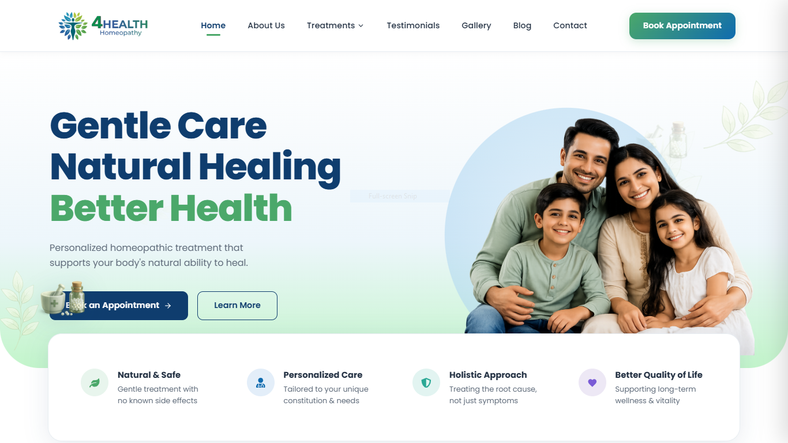
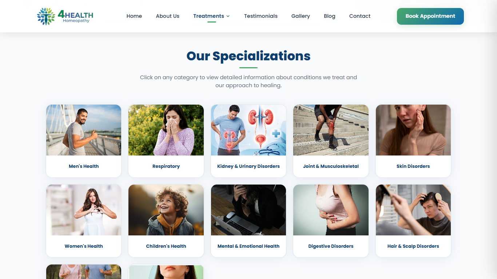
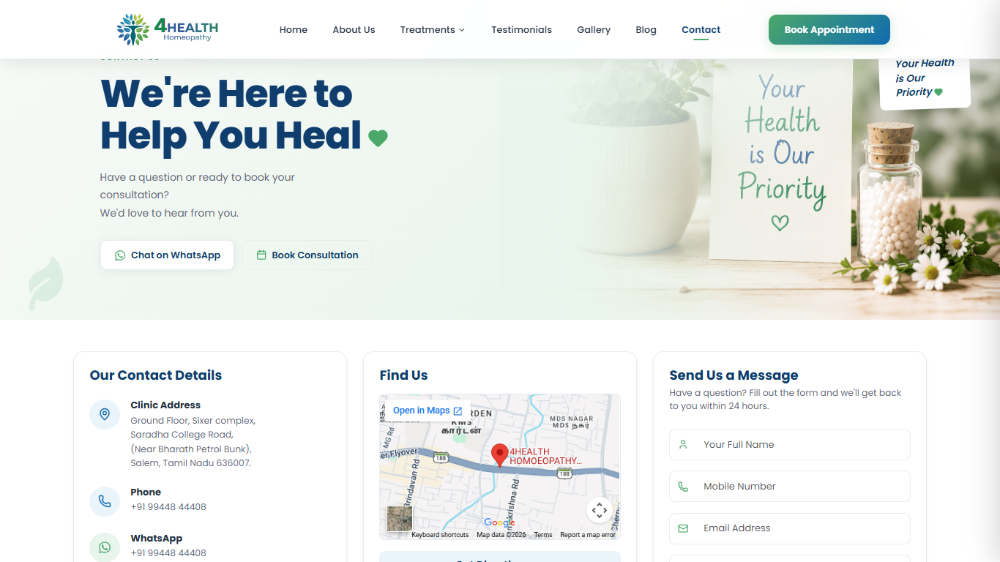
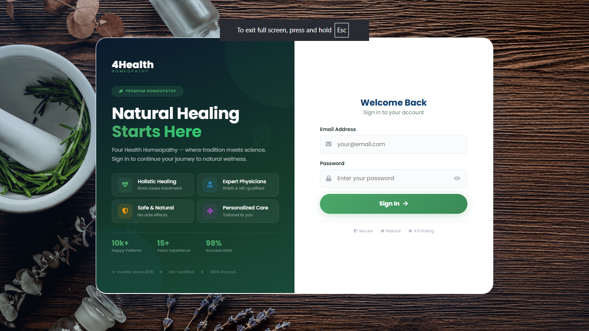
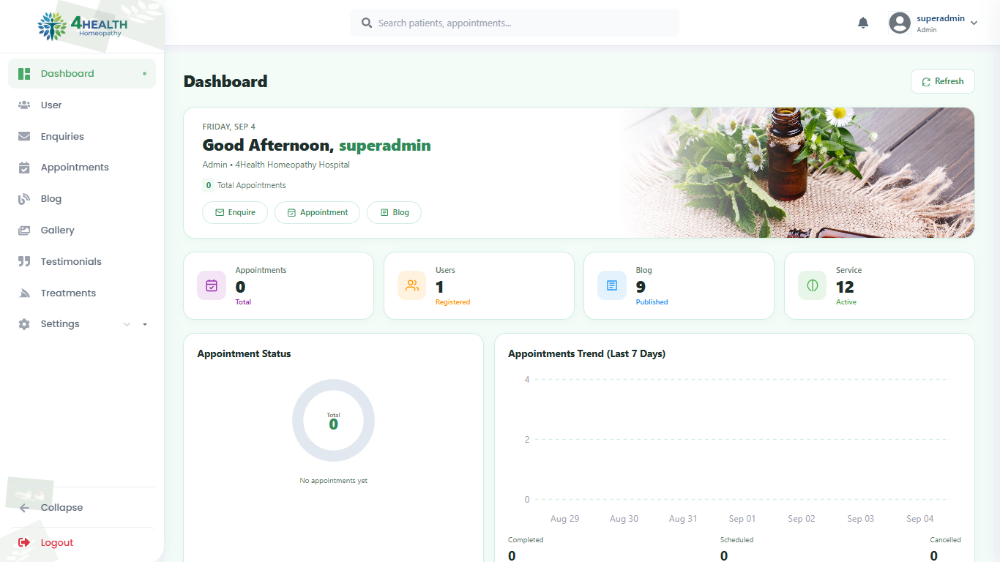
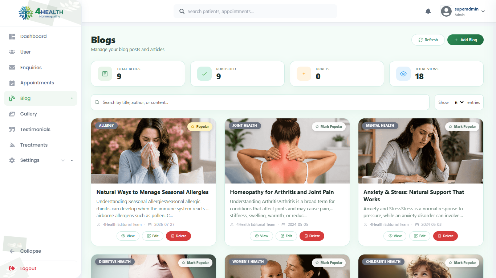

# 🏥 4Health Homeopathy Clinic

A full-stack web application developed for **4Health Homeopathy Clinic**, featuring a modern clinic website and a dedicated admin dashboard for managing dynamic website content.

The application is built using the **MERN Stack** with React.js, Node.js, Express.js and MongoDB.

---

## 🌐 Project Overview

The 4Health Homeopathy Clinic platform provides an online presence for the clinic and allows visitors to explore healthcare services, wellness programs, doctors, blogs, testimonials and other clinic information.

The project also includes a secure **Admin Panel** that allows administrators to manage the website's dynamic content from a centralized dashboard.

---

## ✨ Features

### 🌐 Clinic Website

- 🏠 Responsive Home Page
- 🩺 Homeopathy Services
- 👨‍⚕️ Doctor Information
- 🌿 Wellness Programs
- 🥗 Diet Plan Information
- 💻 Online Consultation
- 📅 Appointment Booking
- 📩 Contact & Enquiry Form
- 📝 Blog Section
- 🖼️ Gallery
- ⭐ Testimonials
- ⭐ Google Reviews
- 🔐 Admin Login
- 🔒 Privacy Policy

---

### 🔐 Admin Dashboard

The admin panel provides centralized management of the clinic website.

#### Dashboard

- Overview of website data
- Centralized administration

#### Appointment Management

- View appointments
- Manage appointment information

#### Enquiry Management

- View customer enquiries
- Manage enquiry information

#### Blog Management

- Add blogs
- View blogs
- Edit blog details
- Manage blog content

#### Gallery Management

- Upload gallery images
- Manage gallery content

#### Service Management

- Add services
- Edit services
- Manage service details

#### Testimonial Management

- Manage patient testimonials

#### User Management

- Manage admin users

#### General Settings

- Manage general website settings

#### Google Reviews

- Google Reviews integration
- Review synchronization

---


## 📸 Screenshots

### 🌐 Website

#### Home Page


#### Services


#### Appointment


### 🔐 Admin Dashboard

#### Admin Login


#### Dashboard


#### Blog Management



## 🛠️ Tech Stack

### Frontend

- React.js
- JavaScript
- HTML5
- CSS3
- React Router
- Axios

### Backend

- Node.js
- Express.js
- REST API
- JWT Authentication
- Multer
- Nodemailer

### Database

- MongoDB
- Mongoose

### Development Tools

- Git
- GitHub
- Postman
- Visual Studio Code

---

## 📂 Project Structure

```text
4health-homeopathy-clinic/
│
├── Backend/
│   ├── CommonIdGenerate/
│   ├── middlewares/
│   ├── models/
│   ├── routes/
│   ├── services/
│   ├── utils/
│   ├── uploads/
│   ├── index.js
│   ├── package.json
│   └── .env.example
│
├── Frontend/
│   ├── public/
│   ├── src/
│   │   ├── Components/
│   │   │   ├── AdminPanel/
│   │   │   ├── Common/
│   │   │   ├── Login/
│   │   │   └── Website/
│   │   ├── assets/
│   │   ├── App.js
│   │   └── index.js
│   └── package.json
│
├── .gitignore
└── README.md

